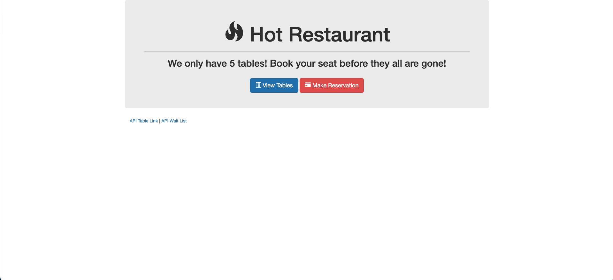

# mini-project-hot-restaurant
   

## Deployed Application
[Heroku](https://mini-project-hot-restaurant.herokuapp.com/)

## Description
Get a reservation at the hottest restaurant in town! Hurry because there's only 5 tables in the place.

## Project Goals:
- Routing with Express.js
- Nodejs File System
- HTML Requests
- Heroku CLI deployment

## Skills Learned
- [Express](https://developer.mozilla.org/en-US/docs/Learn/Server-side/Express_Nodejs)
- [Node.js](https://developer.mozilla.org/en-US/docs/Glossary/Node.js?utm_campaign=feed&utm_medium=rss&utm_source=developer.mozilla.org)
- [Heroku](https://www.heroku.com/)
## Resources
- [Node.js Documentation](https://nodejs.org/en/docs/)
- [Express Guide](https://expressjs.com/en/guide/routing.html)
- [Heroku Git Deploy](https://devcenter.heroku.com/articles/git)
- **General Reference ->** [MDN](https://developer.mozilla.org/en-US/)